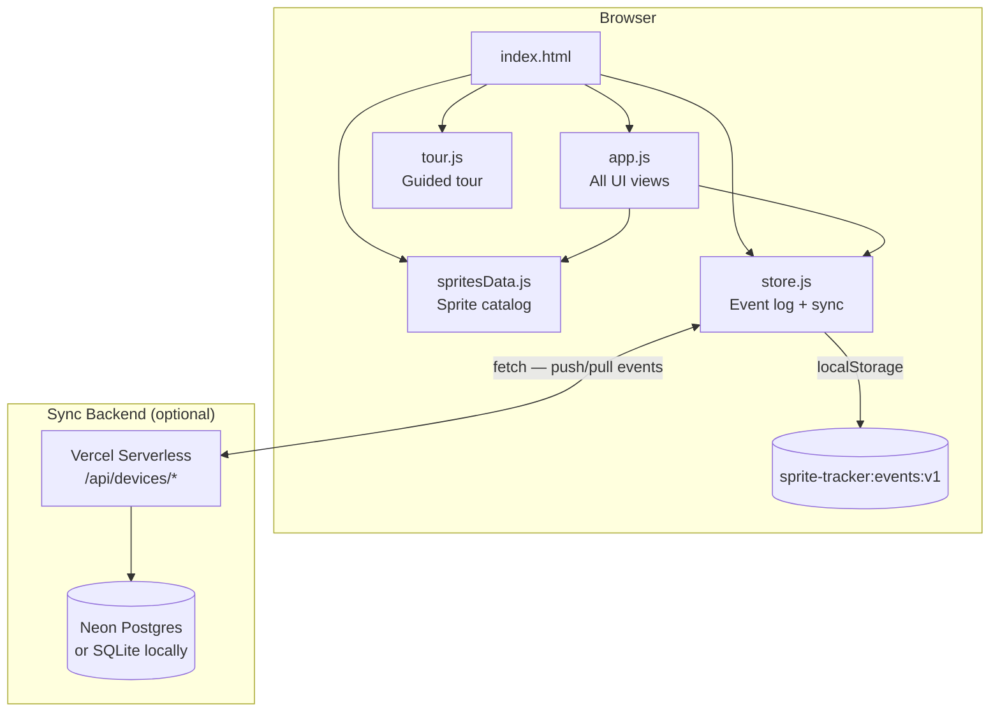
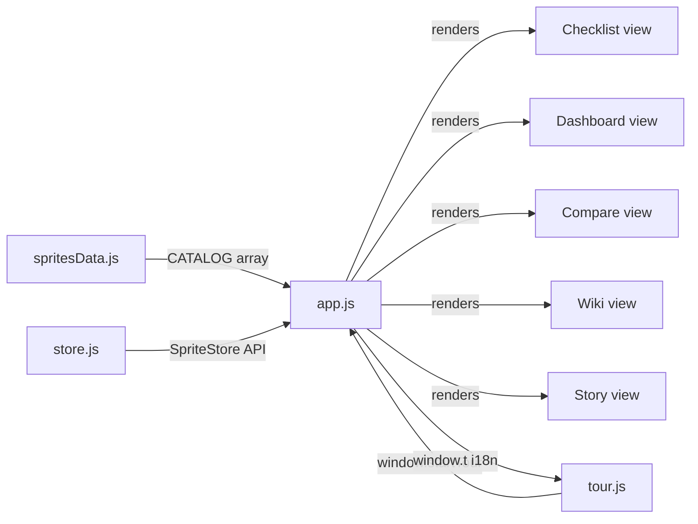
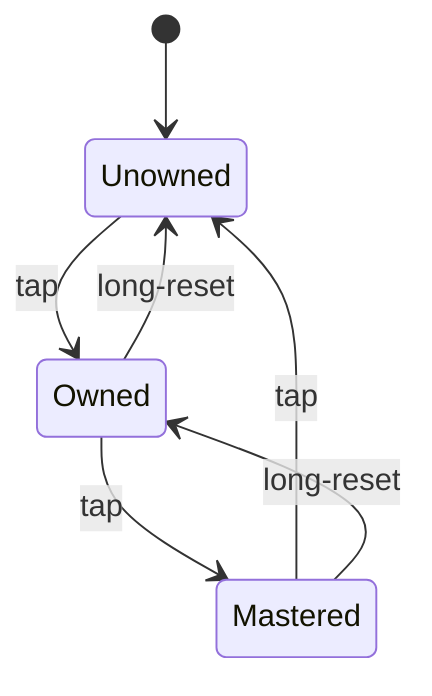
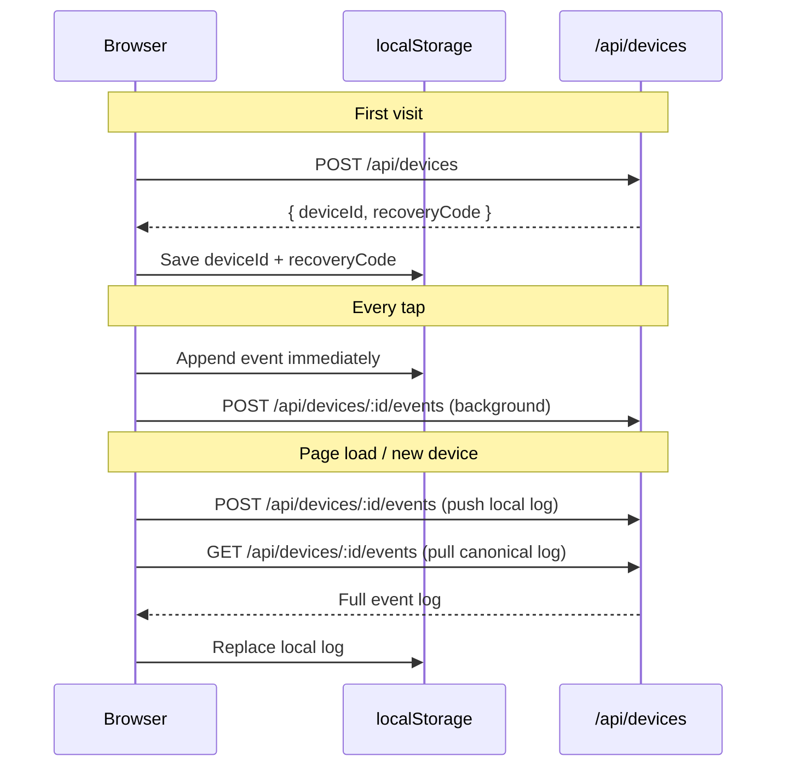
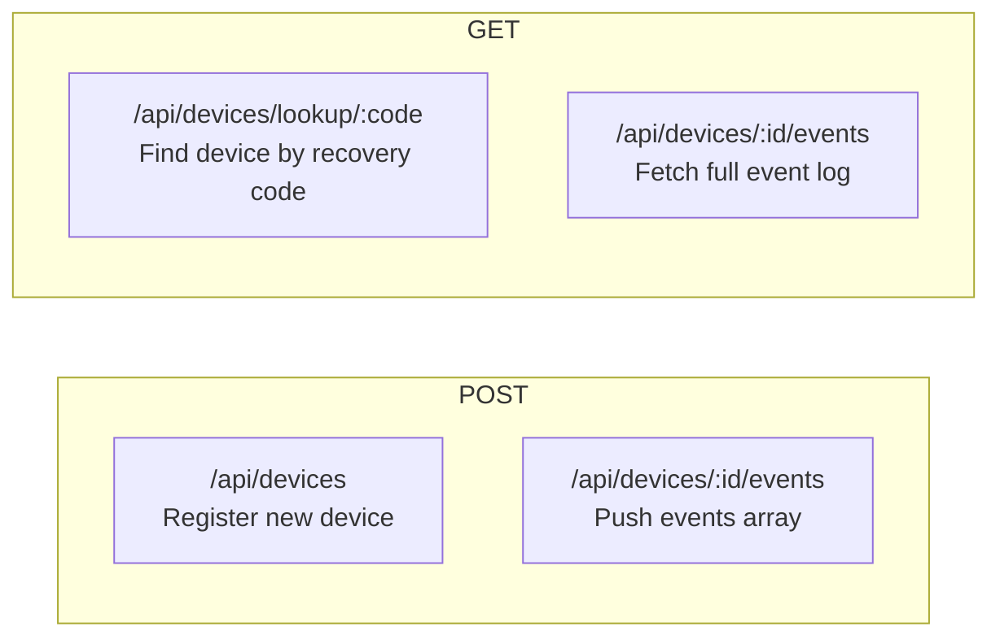

# Sprite Tracker · Fortnite

> An unofficial, account-free checklist and progress dashboard for Fortnite Sprites.
> No login. No ads. Everything stays in your browser.

**Live app →** [sprite-tracker-ten.vercel.app](https://sprite-tracker-ten.vercel.app)

---

## What it is

Fortnite tracks Sprite Mastery internally, but exposes no per-Sprite data through any public API — every third-party Sprite tracker is a manual checklist for exactly this reason. This one just happens to be a good one: real Sprite art, smart filters, a progress dashboard, cross-device sync, and a shareable collection card.

### Features

| Feature | Details |
|---|---|
| **Checklist** | Tap once → Owned ✓, again → Mastered ★, again → clear. Grouped by species with search, rarity, variant, and sort filters |
| **Season view** | Filter by Ch6 S1, Ch7 S3, Ch7 S4 — rings show per-season counts |
| **Dashboard** | Progress-over-time SVG chart, completion by rarity / variant / species, recent-activity feed |
| **Wiki** | Every Sprite's ability, season, drop locations, and all variants at a glance |
| **Compare** | Add up to 4 friends by sync code and see everyone's collection side-by-side |
| **Sync** | Anonymous sync codes (`adjective-animal-number`) — no account needed. Works across browsers and devices |
| **Share** | Read-only link + downloadable 1080×1080 collection card. iOS long-press → Save to Photos; Android download button |
| **Export / Import** | Full JSON backup of your event log |
| **i18n** | English / Spanish toggle, persisted to `localStorage` |
| **Admin** | Password-protected dashboard at `/admin` (Vercel deployment only) |

---

## Architecture

### High-level overview



### Frontend file responsibilities



### Sprite state machine

Each Sprite cycles through three states on tap:



Every state change appends an immutable event `{ id, owned, mastered, at }` to `localStorage`. The current state is derived by folding the log — the Checklist and Dashboard are always in sync because they read the same source of truth.

---

## Sync model



**Local-first:** localStorage is written synchronously on every tap so the app feels instant and works offline. The server push/pull happens in the background. If the server is unreachable, the local log accumulates and is pushed on the next successful connection.

**Recovery:** the human-readable sync code (`e.g. gentle-deer-72`) is the only thing a user needs to save. Entering it in the Sync modal on a new device pulls the full event log for that account.

---

## API reference

All routes are under `/api/devices`. The Vercel deployment uses serverless functions in `api/`; the local dev server (`server/`) is an Express app with the same routes.



| Method | Route | Body / Params | Returns |
|---|---|---|---|
| `POST` | `/api/devices` | — | `{ deviceId, recoveryCode }` |
| `GET` | `/api/devices/lookup/:code` | `:code` = recovery code | `{ deviceId }` |
| `GET` | `/api/devices/:deviceId/events` | — | `{ events: [...] }` |
| `POST` | `/api/devices/:deviceId/events` | `{ events: [...] }` | `{ inserted }` — idempotent |

Event shape: `{ id: string, owned: boolean, mastered: boolean, at: ISO8601 }`

---

## Running locally

No build step, no framework. The frontend is zero-dependency — just open `index.html`.

```bash
# 1. Download Sprite images once (Node built-ins only, no npm install)
node scripts/download-images.js

# 2a. Static frontend only (no sync)
python3 -m http.server 8080
# or: npx serve .

# 2b. With the sync backend
cd server
npm install
npm run dev          # → http://localhost:3000
```

The sync backend uses `node:sqlite` (Node's built-in — no native compilation, no extra deps beyond Express).

---

## Deployment

### Vercel (recommended)

The repo is structured for zero-config Vercel deployment:

- Static files served from the root
- Serverless API functions in `api/`
- Database: set `NEON_DATABASE_URL` environment variable → Neon Postgres

```bash
# Set in Vercel dashboard or via CLI
vercel env add NEON_DATABASE_URL
```

### Docker (self-hosted)

```bash
# Build image (run download-images first so images/ is populated)
node scripts/download-images.js
docker build -t sprite-tracker .

# Run — mount a volume so SQLite persists across restarts
docker run -p 3000:3000 -v $(pwd)/data:/app/data sprite-tracker
```

### GitHub Pages / Netlify / Cloudflare Pages

Works as a static-only deploy (no sync). Run `node scripts/download-images.js` before deploying so `images/` is included.

---

## Updating the Sprite catalog

Epic adds Sprites and variants mid-season. All data lives in `spritesData.js`.

### Add a new variant to an existing species

```js
// spritesData.js → SPECIES array
['Peeky Peely', 'epic', ['Base', 'Gold', 'NewVariant'], 'ability text...', 'ch7s4'],
//                                        ^^^^^^^^^^^

// spritesData.js → ICON_SOURCES
'peeky-peely-newvariant': 'https://example.com/image.jpg',
```

Then re-run: `node scripts/download-images.js`

### Add a new species

```js
// SPECIES entry: [displayName, rarity, variants[], ability, season]
['X-Ray', 'legendary', ['Base', 'Gold'], 'Reveals players through walls...', 'ch7s4'],

// ICON_SOURCES entry (omit if no image yet — app falls back to colored tile)
'x-ray-base': 'https://example.com/x-ray-sprite.jpg',
'x-ray-gold': 'https://example.com/x-ray-sprite-gold.jpg',
```

Sprite IDs are auto-generated: `slugify(species) + '-' + slugify(variant)` → `x-ray-base`.

### Add Wiki info

```js
// app.js → WIKI_INFO object
'x-ray': {
  locations: 'Found in chests across the map',
  lore: 'A community-designed Sprite...',
},
```

---

## Project structure

```
sprite-tracker/
├── index.html          # Shell — loads JS files in order, all modals
├── style.css           # All styling, no CSS framework
├── spritesData.js      # Sprite catalog (UMD — works in browser + Node)
├── store.js            # Data layer: event log, localStorage, sync fetch calls
├── app.js              # All UI views + i18n (STRINGS object, t() helper)
├── tour.js             # Guided tour overlay
├── share.html          # Read-only public collection view
│
├── api/                # Vercel serverless functions
│   ├── _db.js          # Neon Postgres connection
│   └── devices/        # Route handlers mirroring server/ routes
│
├── server/             # Local dev Express backend
│   ├── index.js        # Express app + SQLite (node:sqlite)
│   └── package.json
│
├── scripts/
│   └── download-images.js   # One-time image downloader (Node built-ins only)
│
├── images/             # Self-hosted Sprite icons (downloaded, not hotlinked)
├── Dockerfile          # Single-container Docker build
└── vercel.json         # Clean URLs + no trailing slash
```

---

## Tech stack

| Layer | Choice | Why |
|---|---|---|
| Frontend | Vanilla HTML / CSS / JS | No build step — anyone can fork and edit |
| Data | `localStorage` event log | Offline-first, append-only, never corrupt |
| Sync backend (local) | Node + Express + `node:sqlite` | Zero native deps, ships with Node 22 |
| Sync backend (prod) | Vercel Serverless + Neon Postgres | Free tier, edge-close, no server to manage |
| Deployment | Vercel | Zero-config for this structure |
| Images | Self-hosted in `images/` | No hotlinking — app works after source sites update |

---

## Disclaimer

Unofficial fan project — not affiliated with, endorsed by, or sponsored by Epic Games, Inc.
Fortnite is a trademark of Epic Games, Inc. Sprite names, rarities, abilities, and images were compiled from public sources. Everything you check off is stored in your own browser — nothing is sent to a server without your explicit sync action.
